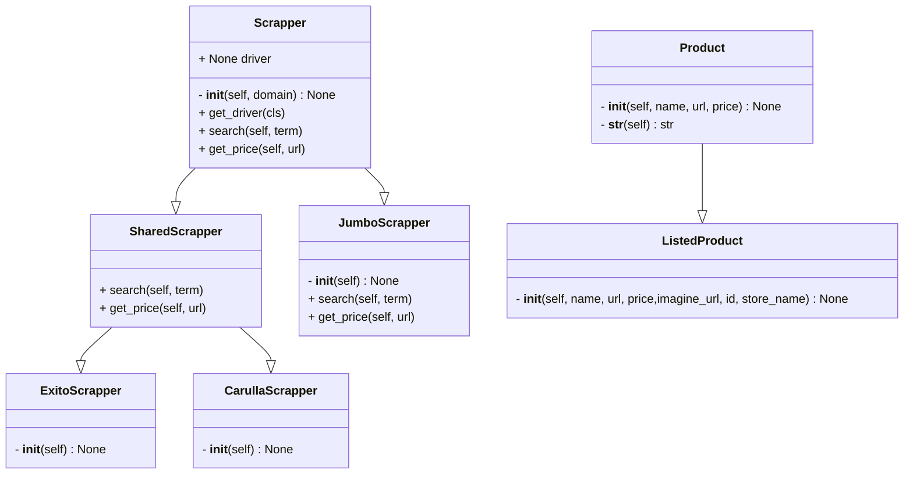

# price-tracker

## To run locally
1. Ensure you have Python installed (version 3.6 or higher) and Firefox.

2. Clone the repository.
    ```bash
   git clone https://github.com/forerosantiago/price-tracker
    ```

3. Navigate to the project directory.
   ```bash
   cd price-tracker
   ```

4. Create a virtual python enviroment
    ```bash
   python -m venv venv
    ```

5. Activate the virtual environment
    ```bash
   source venv/bin/activate
    ```

6. Install the required packages:
   ```bash
   pip install -r requirements.txt
   ```

7. Run the database setup script:
   ```bash
   python db_setup.py
   ```

8. Run the app script:
   ```bash
   python app.py
   ```

## To run in Docker
1. `git clone https://github.com/forerosantiago/price-tracker`
2. `cd price-tracker`
3. `docker build -t price-tracker .`
4. `docker run -it --rm price-tracker`
## Class Diagram 



