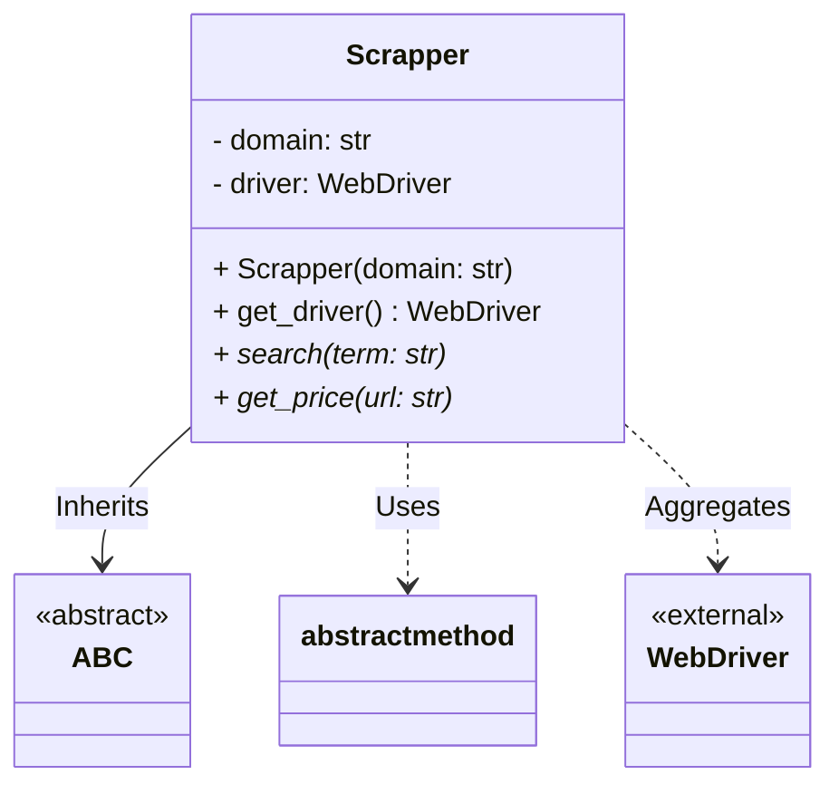

# price-tracker

## To run locally
1. Ensure you have Python installed (version 3.6 or higher).
2. Clone the repository.
    ```bash
   git clone https://github.com/forerosantiago/price-tracker
    ```
3. Navigate to the project directory.
   ```bash
   cd price-tracker
   ```
4. Install the required packages:
   ```bash
   pip install -r requirements.txt
   ```
5. Run the main script:
   ```bash
   python main.py
   ```

## To run in Docker
1. `git clone https://github.com/forerosantiago/price-tracker`
2. `cd price-tracker`
3. `docker build -t price-tracker .`
4. `docker run -it --rm price-tracker`
## Class Diagram
   ```mermaid

classDiagram
    class Scrapper {
        - domain: str
        - driver: WebDriver
        + Scrapper(domain)
        + get_driver() WebDriver
        <<abstract>> + search(term: str)
        <<abstract>> + get_price(url: str)
    }

    class SharedScrapper {
        + SharedScrapper(domain)
        + search(term: str): list
        + get_price(url: str): float
    }

    class Product {
        - name: str
        - url: str
        - price: float
        + Product(name, url, price)
    }

    Scrapper <|-- SharedScrapper
    SharedScrapper ..> Product
```
# Scrapper

```
